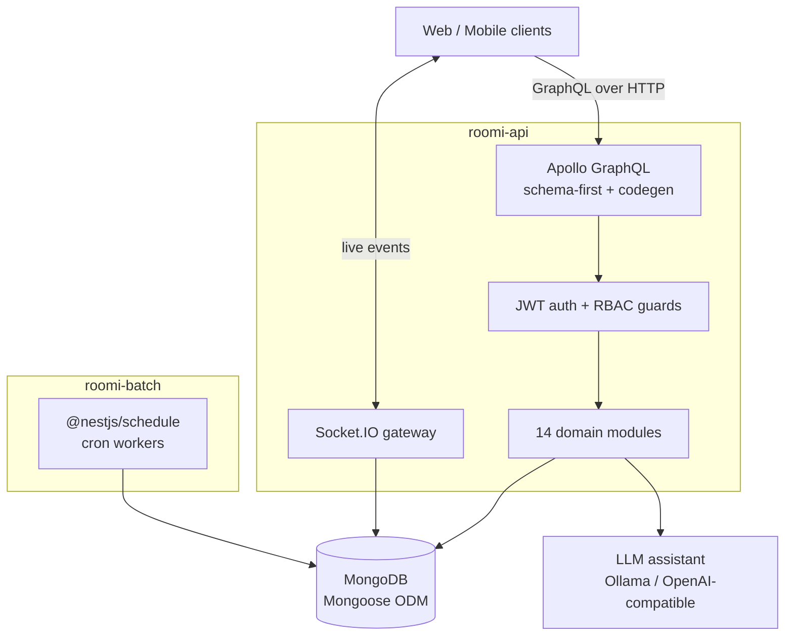

# ROOMi — Backend API

**GraphQL-first booking platform backend.** A NestJS monorepo covering the full reservation lifecycle: property listings, availability, bookings, payments, reviews, real-time notifications, and role-scoped dashboards for guests, agents, and administrators.


> Frontend client: **[ROOMi-frontend](https://github.com/myx-codes/ROOMi-frontend)**

---

## About this project

ROOMi is a personal project built to practise designing and operating a complete, production-shaped backend rather than a tutorial CRUD app. The goal was to work through the problems that only appear at system level: schema design across a dozen related domains, authorisation that differs per role, state that must stay consistent between HTTP and WebSocket clients, and background work that cannot live inside a request cycle.

It has not served production traffic. Everything below describes the system as it is implemented in this repository.

---

## Architecture

The repository is a NestJS monorepo with two deployable applications that share the same schemas, database layer, and libraries.



### Applications

| App | Entry point | Responsibility |
|---|---|---|
| `roomi-api` | `apps/roomi-api` | GraphQL API, authentication, WebSocket gateway, file uploads |
| `roomi-batch` | `apps/roomi-batch` | Scheduled jobs — booking expiry, cleanup, periodic ranking updates |

Splitting batch work into its own process keeps long-running jobs off the request path and lets the two scale independently.

### Domain modules

Business logic lives in `apps/roomi-api/src/components`, one module per bounded concern:

`auth` · `member` · `property` · `availability` · `booking` · `payment` · `rating` · `comment` · `like` · `view` · `notification` · `board-article` · `agent-dashboard` · `assistant`

Each module owns its resolvers, service layer, DTOs, and validation, so a change to booking rules stays inside the booking module.

---

## Implementation notes

**GraphQL with generated types.** The schema is the contract. `codegen.ts` generates TypeScript types from it, so resolver signatures and the client stay in sync at compile time instead of at runtime.

**Layered authorisation.** Authentication issues JWTs; authorisation is enforced by NestJS guards that resolve the caller's role (guest, agent, admin) before a resolver runs. Role checks are declarative rather than scattered through service code.

**Real-time updates.** A Socket.IO gateway pushes booking state changes and notifications to connected clients, so a reservation confirmed by an agent appears on the guest's screen without a refresh.

**Scheduled work.** `roomi-batch` uses `@nestjs/schedule` for jobs that must run independently of user requests — releasing expired unconfirmed bookings, clearing stale records, recomputing derived counters.

**File handling.** Property images are uploaded through `graphql-upload` and served from a mounted volume, with a Docker volume so uploads survive container restarts.

**AI assistant.** The `assistant` module talks to any OpenAI-compatible endpoint. It defaults to a locally hosted Ollama model, which means the assistant can be developed and demonstrated without a paid API key, and swapped to a hosted provider by changing environment variables alone.

**Validation.** `class-validator` and `class-transformer` validate and shape every input DTO at the boundary, so invalid data never reaches the service layer.

---

## Tech stack

| Layer | Technologies |
|---|---|
| Runtime | Node.js, TypeScript 5.7 |
| Framework | NestJS 11 (monorepo) |
| API | Apollo Server 5, `@nestjs/graphql`, GraphQL Codegen |
| Database | MongoDB, Mongoose 9 |
| Auth | `@nestjs/jwt`, bcryptjs, cookie-parser |
| Real-time | Socket.IO, `@nestjs/websockets` |
| Scheduling | `@nestjs/schedule` |
| Uploads | graphql-upload |
| AI | Ollama / OpenAI-compatible API via `@nestjs/axios` |
| Tooling | ESLint, Prettier, Jest |
| Deployment | Docker, Docker Compose, Nginx reverse proxy |

---

## Getting started

### Prerequisites

- Node.js 20+
- MongoDB (local or Atlas)
- Docker and Docker Compose (optional, for the full stack)
- Ollama (optional, for the AI assistant)

### Local setup

```bash
git clone https://github.com/myx-codes/ROOMi-backend.git
cd ROOMi-backend
npm install
cp .env.example .env      # then fill in the values below
```

### Environment variables

| Variable | Description |
|---|---|
| `MONGO_URL` | MongoDB connection string |
| `PORT_API` | Port for the GraphQL API |
| `PORT_BATCH` | Port for the batch application |
| `SECRET_TOKEN` | JWT signing secret |
| `AI_PROVIDER` | `ollama` or another OpenAI-compatible provider |
| `AI_BASE_URL` | Provider base URL, e.g. `http://localhost:11434/v1` |
| `AI_MODEL` | Model name, e.g. `gemma3:1b` |

See `.env.example` for the complete list.

### Run

```bash
npm run start:dev            # API, watch mode
npm run start:dev:batch      # batch worker, watch mode
```

### AI assistant (optional)

```bash
ollama serve
ollama pull gemma3:1b
```

When running the Docker stack, the `roomi-ollama` service is included in `docker-compose.yml`.

### Production

```bash
npm run build
npm run start:prod           # node dist/apps/roomi-api/main
npm run start:prod:batch     # node dist/apps/roomi-batch/main
```

### Tests

```bash
npm run test          # unit
npm run test:e2e      # end-to-end
npm run test:cov      # coverage
```

---

## Repository layout

```
apps/
  roomi-api/          GraphQL API application
    src/
      components/     14 domain modules
      database/       Mongoose connection and models
      libs/           shared enums, DTOs, types, utilities
      schemas/        Mongoose schemas
      socket/         Socket.IO gateway
  roomi-batch/        scheduled job application
src/generated/        GraphQL codegen output
codegen.ts            GraphQL Codegen configuration
Dockerfile
docker-compose.yml
```

---

## Author

**Mukhammadyusuf Kholbajonov** — Backend / Full-Stack Engineer
MSc Computer Engineering, Dongguk University, Seoul
[GitHub](https://github.com/myx-codes)
